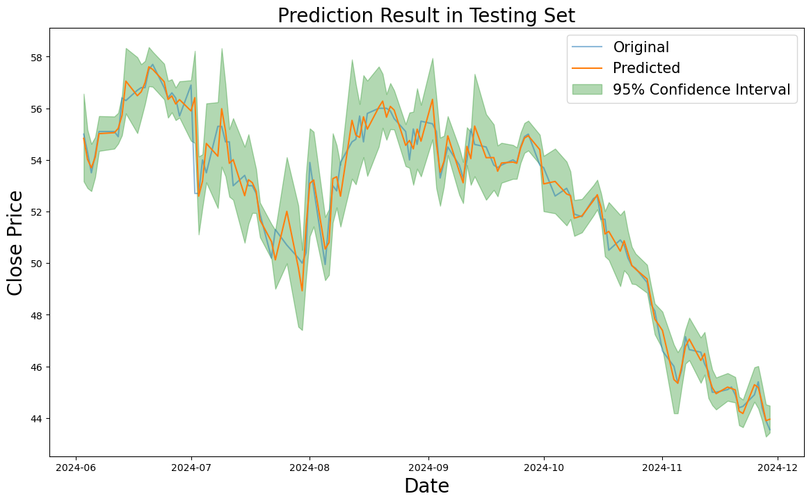

# 📈 Stock Price Prediction

本專案目標是預測未來的股價與漲跌方向，並探討不同資料與模型組合對預測效果的影響，核心模型為 LSTM 結合傅立葉轉換（FFT）與 GARCH 估計不確定性。

---

## 🎯 研究目標

1. 預測未來一天的 **股價**（連續型變數）
2. 預測未來一天的 **漲跌方向**（分類任務：二元\三元）
3. 探討財報與總體經濟變數是否有助於提升預測能力

---

## 🧾 資料說明

- 時間範圍：2019/10/29 至 2024/11/29
- 交易日數：共 1,238 天
- 資料來源：
  - **日資料（17 欄）**：收盤價、成交量、技術指標等（Yahoo、TEJ）
  - **月資料（20 欄）**：利率、GDP、CPI、失業率等（台灣＋美國）
  - **季資料（9 欄）**：財報指標（來自 TEJ）
- 從多種角度分析後發現，其他財報與總體經濟變數對股價預測幫助有限，因此最終以 **收盤價作為主要變數**。

---

## 🔧 模型流程

### Step 1：Log return
- 為什麼？(詳情請看最底下的**專案檔案**)
  - 原始價格具有非定態性與強烈的自相關，會讓深度學習模型難以學習。因此我們先將價格轉為 log return，使資料更穩定、波動性更小，適合建模。
- 防止模型訓練錯誤的問題

### Step 2：訊號降噪（FFT）
- 為什麼？(詳情請看最底下的**專案檔案**)
  - 訓練初期發現模型對 log return 的訓練無法收斂，懷疑資料中存在大量高頻雜訊（如：隨機跳動）。因此採用傅立葉轉換（FFT）將頻率域資訊拆解，並移除高頻成分以強化訊號。
- 使用傅立葉轉換移除高頻雜訊
- 最佳截止頻率 cutoff = **0.33**

### Step 3：預測去噪後報酬率
- 訓練 LSTM 模型預測平滑過的 .svg)
- LSTM細節:
  - Hyperparameters: Past time steps: 25
  - Number of Layers: 2 LSTM layers
  - Learning rate: 0.001

### Step 4：預測收盤價
- 利用轉換關係：
  

### Step 5：建立信賴區間（GARCH）
- 對 log return residual 建立 **GARCH(1,1)** 模型估計波動
- 建立 **95% 預測區間**

---
## 📈 股價預測結果

依照Step 1 到Step 5的結果如下，可以看到真實的股價大部分都在我們的95%信賴區間內。

---

## 📊 漲跌方向預測結果

| 分類類型   | 預測準確率 | 理論隨機猜測準確率 |
|------------|------------|------------|
| 二元分類（上漲 / 下跌） | 約 **80%** | 約 **50%** |
| 三元分類（上漲 / 不變 / 下跌） | 約 **70.5%** | 約 **33%** |

---

## 📊 財報資訊貢獻評估

- 採用 Permutation Importance 與 Forward Selection
- 在未經處理的資料下，使用其他變數無明顯幫助
- 在 FFT 處理過的資料下：
  - 大部分的變數仍沒有用
  - 最佳模型仍為僅使用去噪後的 log return
- **結論:財報資訊在本研究中未顯著提升股價預測效果，顯示其提供的資訊對短期價格變動的解釋力有限。**
 
---

## ✅ 結論摘要

- **直接預測價格效果最差**，因時間序列具高度自相關
- **log return 是更穩定的預測目標**
- **使用傅立葉轉換（FFT）對 log return 去噪後，預測效果明顯提升**
- **財報與總體經濟變數並未顯著提升預測能力**

| 預測方法                 | RMSE   |
|--------------------------|--------|
| 零基準（Always predict 0） | 1.594  |
| 原始 log return          | 1.588  |
| FFT 去噪後報酬率          | **0.993** |
| 全變數模型（共 47 變數）   | 1.592  |

---

## 📁 專案檔案

- [📄 股價預測報告 PDF](./統實_final_report.pdf)

---
